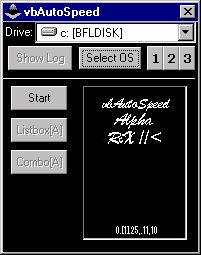



## vbAutoSpeed \- Auto Scandisk and Defragmenter

### Description

Auto Scandisk and Defragments the computer automatically, while logging its actions. This is the beta version. If anyone can tell me how to manipulate another program's listbox or combobox, email me at aobpsn@aol.com. this zip file includes scandisk(sdrun98.exe) and defragmenter(dfrun98.exe) for windows 98. vbAutoSpeed is ready to be integrated into Windows Me Format. PLEASE VOTE FOR ME! I WORKED A LONG TIME FOR THIS!
 
### More Info
 

             |
---                |---
**Submitted On**   |2000-11-17 21:51:54
**By**             |[Eric LeBourgeois](https://github.com/Planet-Source-Code/PSCIndex/blob/master/ByAuthor/eric-lebourgeois.md)
**Level**          |Advanced
**User Rating**    |4.7 (14 globes from 3 users)
**Compatibility**  |VB 5\.0, VB 6\.0
**Category**       |[Complete Applications](https://github.com/Planet-Source-Code/PSCIndex/blob/master/ByCategory/complete-applications__1-27.md)
**World**          |[Visual Basic](https://github.com/Planet-Source-Code/PSCIndex/blob/master/ByWorld/visual-basic.md)
**Archive File**   |[CODE\_UPLOAD1179411172000\.zip](https://github.com/Planet-Source-Code/eric-lebourgeois-vbautospeed-auto-scandisk-and-defragmenter__1-12886/archive/master.zip)

### API Declarations

Code includes: how to manipulate windows, how to set a window's text, how to save options on exit and load them on startup, how to save a text file, and a demonstration on the uses of checkboxes.

